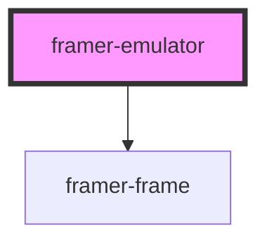

# framer-emulator

<!-- Auto Generated Below -->

## Properties

| Property     | Attribute     | Description                                                                                | Type      | Default          |
| ------------ | ------------- | ------------------------------------------------------------------------------------------ | --------- | ---------------- |
| `deviceName` | `device-name` | The name of the device to emulate.                                                         | `string`  | `'iPhone 6/7/8'` |
| `disabled`   | `disabled`    | Don't render the emulator. Useful when the emulator is hidden on load.                     | `boolean` | `false`          |
| `ionicMode`  | `ionic-mode`  | Emulate the design of Ionic Framework applications.                                        | `boolean` | `false`          |
| `landscape`  | `landscape`   | Show the device in landscape mode.                                                         | `boolean` | `null`           |
| `url`        | `url`         | The URL to load.                                                                           | `string`  | `undefined`      |
| `useHeight`  | `use-height`  | Whether to calculate the size based on height instead of width. Requires a defined height. | `boolean` | `false`          |

## Methods

### `focusFrame() => Promise<void>`

Focus the iFrame.

#### Returns

Type: `Promise<void>`

## Dependencies

### Depends on

- [framer-frame](../frame)

### Graph

----------------------------------------------

*Built with [StencilJS](https://stenciljs.com/)*
