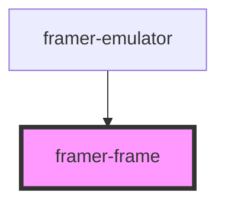

# framer-frame

<!-- Auto Generated Below -->

## Properties

| Property    | Attribute    | Description                                                                                                | Type      | Default     |
| ----------- | ------------ | ---------------------------------------------------------------------------------------------------------- | --------- | ----------- |
| `disabled`  | `disabled`   | Don't render the frame. Useful when the frame is hidden on load.                                           | `boolean` | `false`     |
| `fheight`   | `fheight`    | The emulated height.                                                                                       | `number`  | `undefined` |
| `fwidth`    | `fwidth`     | The emulated width.                                                                                        | `number`  | `undefined` |
| `url`       | `url`        | The URL to display.                                                                                        | `string`  | `undefined` |
| `useHeight` | `use-height` | Whether to calculate the size based on height instead of width. Requires you to define a height using CSS. | `boolean` | `false`     |

## Events

| Event         | Description                                | Type                |
| ------------- | ------------------------------------------ | ------------------- |
| `frameLoaded` | Fires when the frame has initially loaded. | `CustomEvent<void>` |

## Methods

### `focusFrame() => Promise<void>`

Focus the iFrame.

#### Returns

Type: `Promise<void>`

### `getFrame() => Promise<HTMLIFrameElement>`

Get the iFrame element.

#### Returns

Type: `Promise<HTMLIFrameElement>`

## Dependencies

### Used by

 - [framer-emulator](../emulator)

### Graph

----------------------------------------------

*Built with [StencilJS](https://stenciljs.com/)*
